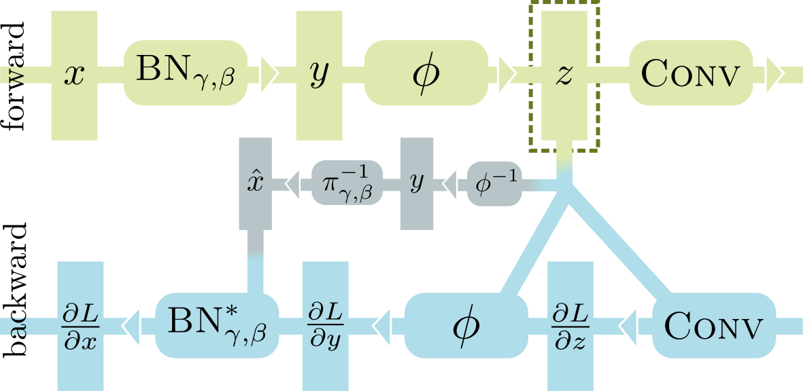

# In-Place Activated BatchNorm

[**In-Place Activated BatchNorm for Memory-Optimized Training of DNNs**](https://arxiv.org/abs/1712.02616)

In-Place Activated BatchNorm (InPlace-ABN) is a novel approach to reduce the memory required for training deep networks.
It allows for up to 50% memory savings in modern architectures such as ResNet, ResNeXt and Wider ResNet by redefining
BN + non linear activation as a single in-place operation, while smartly dropping or recomputing intermediate buffers as
needed.

This repository contains a [PyTorch](http://pytorch.org/) implementation of the InPlace-ABN layer, as well as some
training scripts to reproduce the ImageNet classification results reported in our paper.

- [Overview](#overview)
- [Installation](#installation)
- [Training on ImageNet](#training-on-imagenet)

We have now also released the inference code for semantic segmentation, together with the Mapillary Vistas trained model leading to [#1 position on the Mapillary Vistas Semantic Segmentation leaderboard](https://eval-vistas.mapillary.com/featured-challenges/1/leaderboard/1). More information can be found at the bottom of this page.

## Citation

If you use In-Place Activated BatchNorm in your research, please cite:
```bibtex
@inproceedings{rotabulo2017place,
  title={In-Place Activated BatchNorm for Memory-Optimized Training of DNNs},
  author={Rota Bul\`o, Samuel and Porzi, Lorenzo and Kontschieder, Peter},
  booktitle={Proceedings of the IEEE Conference on Computer Vision and Pattern Recognition},
  year={2018}
}
```

## Overview

<p align="center"></p>

When processing a BN-Activation-Convolution sequence in the forward pass, most deep learning frameworks need to store
two big buffers, _i.e._ the input `x` of BN and the input `z` of Conv.
This is necessary because the standard implementations of the backward passes of BN and Conv depend on their inputs to
calculate the gradients.
Using Inplace-ABN to replace the BN-Activation sequence, we can safely discard `x`, thus saving up to 50% GPU memory at
training time.
To achieve this, we rewrite the backward pass of BN in terms of its output `y`, which is in turn reconstructed from `z`
by inverting the activation function.

The parametrization for the scaling factor of BN changed compared to standard BN, in order to ensure an invertible transformation. Specifically, the scaling factor becomes
.

## Requirements

To install PyTorch, please refer to https://github.com/pytorch/pytorch#installation.

**NOTE 1: our code _requires_ PyTorch v1.1 or later**

**NOTE 2: we are only able to provide support for Linux platforms and CUDA versions >= 10.0**

**NOTE 3: in general, it is not possible to load weights from a network trained with standard BN into an InPlace-ABN network without severe performance degradation, due to the different handling of BN scaling parameters**

To install the package containing the iABN layers:
```bash
pip install git+https://github.com/mapillary/inplace_abn.git@v1.0.12
```
Note that some parts of InPlace-ABN have native C++/CUDA implementations, meaning that the command above will need to
compile them.

Alternatively, to download and install the latest version of our library, also obtaining a copy of the Imagenet / Vistas
scripts:
```bash
git clone https://github.com/mapillary/inplace_abn.git
cd inplace_abn
python setup.py install
cd scripts
pip install -r requirements.txt
```
The last of the commands above will install some additional libraries required by the Imagenet / Vistas scripts.

## Training on ImageNet-1k

Here you can find the results from our arXiv paper (top-1 / top-5 scores) with corresponding, trained models and md5 checksums, respectively. The model files provided below are made available under the [license attached to ImageNet](http://www.image-net.org/download-faq). 

| Network                           | Batch | 224            | 224, 10-crops  | 320           |       Trained models (+md5)      |
|-----------------------------------|-------|----------------|----------------|---------------|----------------------------------|
| [ResNeXt101, Std-BN][1]           | 256   | 77.04 / 93.50  | 78.72 / 94.47  | 77.92 / 94.28 | [`448438885986d14db5e870b95f814f91`][6] |
| [ResNeXt101, InPlace-ABN][2]      | 512   | 78.08 / 93.79  | 79.52 / 94.66  | 79.38 / 94.67 | [`3b7a221cbc076410eb12c8dd361b7e4e`][7] |
| [ResNeXt152, InPlace-ABN][3]      | 256   | 78.28 / 94.04  | 79.73 / 94.82  | 79.56 / 94.67 | [`2c8d572587961ed74611d534c5b2e9ce`][8] |
| [WideResNet38, InPlace-ABN][4]    | 256   | 79.72 / 94.78  | 81.03 / 95.43  | 80.69 / 95.27 | [`1c085ab70b789cc1d6c1594f7a761007`][9] |
| [ResNeXt101, InPlace-ABN sync][5] | 256   | 77.70 / 93.78  | 79.18 / 94.60  | 78.98 / 94.56 | [`0a85a21847b15e5a242e17bf3b753849`][10] |
| [DenseNet264, InPlace-ABN][11]    | 256   | 78.57 / 94.17  | 79.72 / 94.93  | 79.49 / 94.89 | [`0b413d67b725619441d0646d663865bf`][12] |
| [ResNet50v1, InPlace-ABN sync][13]  | 512   | 75.53 / 92.59  | 77.04 / 93.57  | 76.60 / 93.49 | [`2522ca639f7fdfd7c0089ba1f5f6c2e8`][14] |
| [ResNet34v1, InPlace-ABN sync][15]  | 512   | 73.27 / 91.34  | 75.19 / 92.66  | 74.87 / 92.42 | [`61515c1484911c3cc753d405131e1dda`][16] |
| [ResNet101v1, InPlace-ABN sync][17]  | 512   | 77.07 / 93.45  | 78.58 / 94.40  | 78.25 / 94.19 | [`1552ae0f3d610108df702135f56bd27b`][18] |
  
[1]: scripts/experiments/resnext101_stdbn_lr_256.json
[2]: scripts/experiments/resnext101_ipabn_lr_512.json
[3]: scripts/experiments/resnext152_ipabn_lr_256.json
[4]: scripts/experiments/wider_resnet38_ipabn_lr_256.json
[5]: scripts/experiments/resnext101_ipabn-sync_lr_256.json
[6]: https://drive.google.com/file/d/1qT8qCSZzUHorai1EP6Liywa28ASac_G_/view
[7]: https://drive.google.com/file/d/1rQd-NoZuCsGZ7_l_X9GO1GGiXeXHE8CT/view
[8]: https://drive.google.com/file/d/1RmHK3tdVTVsHiyNO14bYLkMC0XUjenIn/view
[9]: https://drive.google.com/file/d/1Y0McSz9InDSxMEcBylAbCv1gvyeaz8Ij/view
[10]: https://drive.google.com/file/d/1v2gmUPBMDKf0wZm9r1JwCQLGAig0DdXJ/view
[11]: scripts/experiments/densenet264_ipabn_lr_256.json
[12]: https://drive.google.com/file/d/1J2wp59bzzEd6zttM6oMa1KgbmCL1MS0k/view
[13]: scripts/experiments/resnet50_ipabn-sync_lr_512.json
[14]: https://drive.google.com/file/d/1N7kjWrnUbD_aBOUNi9ZLGnI3E_1ATH8U/view
[15]: scripts/experiments/resnet34_ipabn-sync_lr_512.json
[16]: https://drive.google.com/file/d/1V5dCIZeRCfnZi9krNaQNhXNDHyXz9JR8/view
[17]: scripts/experiments/resnet101_ipabn-sync_lr_512.json
[18]: https://drive.google.com/file/d/1oFVSIUYAxa_uNDq2OLkbhyiFmKwnYzpt/view

### Data preparation

Our script uses [torchvision.datasets.ImageFolder](http://pytorch.org/docs/master/torchvision/datasets.html#torchvision.datasets.ImageFolder)
for loading ImageNet data, which expects folders organized as follows:
```
root/train/[class_id1]/xxx.{jpg,png,jpeg}
root/train/[class_id1]/xxy.{jpg,png,jpeg}
root/train/[class_id2]/xxz.{jpg,png,jpeg}
...

root/val/[class_id1]/asdas.{jpg,png,jpeg}
root/val/[class_id1]/123456.{jpg,png,jpeg}
root/val/[class_id2]/__32_.{jpg,png,jpeg}
...
```
Images can have any name, as long as the extension is that of a recognized image format.
Class ids are also free-form, but they are expected to match between train and validation data.
Note that the training data in the standard ImageNet distribution is already given in the required format, while
validation images need to be split into class sub-folders as described above.  

### Training

The main training script is `scripts/train_imagenet.py`: this supports training on ImageNet, or any other dataset
formatted as described above, while keeping a log of relevant metrics in Tensorboard format and periodically saving
snapshots.
Most training parameters can be specified as a `json`-formatted configuration file (look
[here](scripts/imagenet/config.py) for a complete list of configurable parameters).
All parameters not explicitly specified in the configuration file are set to their defaults, also available in
[scripts/imagenet/config.py](scripts/imagenet/config.py).

Our arXiv results can be reproduced by running `scripts/train_imagenet.py` with the configuration files in
`scripts/experiments`.
As an example, the command to train `ResNeXt101` with InPlace-ABN, Leaky ReLU and `batch_size = 512` is:
```bash
cd scripts
python -m torch.distributed.launch --nproc_per_node <n. GPUs per node> train_imagenet.py --log-dir /path/to/tensorboard/logs experiments/resnext101_ipabn_lr_512.json /path/to/imagenet/root
```

### Validation

Validation is run by `scripts/train_imagenet.py` at the end of every training epoch.
To validate a trained model, you can use the `scripts/test_imagenet.py` script, which allows for 10-crops validation and
transferring weights across compatible networks (_e.g._ from `ResNeXt101` with ReLU to `ResNeXt101` with Leaky
ReLU).
This script accepts the same configuration files as `scripts/train_imagenet.py`, but note that the `scale_val` and
`crop_val` parameters are ignored in favour of the `--scale` and `--crop` command-line arguments.

As an example, to validate the `ResNeXt101` trained above using 10-crops of size `224` from images scaled to `256`
pixels, you can run:
```bash
cd scripts
python -m torch.distributed.launch --nproc_per_node <n. GPUs per node> test_imagenet.py --crop 224 --scale 256 --ten_crops experiments/resnext101_ipabn_lr_512.json /path/to/checkpoint /path/to/imagenet/root
```

## Usage for Semantic Segmentation on Cityscapes and Mapillary Vistas

We have successfully used InPlace-ABN with a DeepLab3 segmentation head that was trained on top of the WideResNet38
model above.
Due to InPlace-ABN, we can significantly increase the amount of input data to this model, which eventually allowed us to
obtain #1 positions on [Cityscapes](https://www.cityscapes-dataset.com/benchmarks/#scene-labeling-task),
[Mapillary Vistas](https://eval-vistas.mapillary.com/featured-challenges/1/leaderboard/1), [AutoNUE](http://cvit.iiit.ac.in/scene-understanding-challenge-2018/benchmarks.php), 
[Kitti](http://www.cvlibs.net/datasets/kitti/eval_semseg.php?benchmark=semantics2015) and
[ScanNet](http://dovahkiin.stanford.edu/adai/semantic_label) segmentation leaderboards.
The training settings mostly follow the description in our [paper](https://arxiv.org/abs/1712.02616).

### Mapillary Vistas pre-trained model

We release our WideResNet38 + DeepLab3 segmentation model trained on the Mapillary Vistas research set.
This is the model used to reach #1 position on the MVD semantic segmentation leaderboard.
The segmentation model file provided below is made available under a
[CC BY-NC-SA 4.0 license](https://creativecommons.org/licenses/by-nc-sa/4.0/).

| Network                       | mIOU  | Trained model (+md5)                   |
|-------------------------------|-------|----------------------------------------|
| [WideResNet38 + DeepLab3][19] | 53.42 | [913f78486a34aa1577a7cd295e8a33bb][20] |

[19]: scripts/test_vistas.py
[20]: https://drive.google.com/file/d/1SJJx5-LFG3J3M99TrPMU-z6ZmgWynxo-/view

To use this, please download the `.pth.tar` model file linked above and run the `test_vistas.py` script as follows:
```bash
cd scripts
python test_vistas.py /path/to/model.pth.tar /path/to/input/folder /path/to/output/folder
```

The script will process all `.png`, `.jpg` and `.jpeg` images from the input folder and write the predictions in the
output folder as `.png` images.
For additional options, _e.g._ test time augmentation, please consult the script's help message.

The results on the test data written above were obtained by employing only scale 1.0 + flipping. 

## Changelog

**Update 04 Jul. 2019: version 1.0.0**
- Complete rewrite of the CUDA code following the most recent native BN implementation from Pytorch
- Improved synchronized BN implementation, correctly handling different per-GPU batch sizes and Pytorch distributed groups
- The iABN layers are now packaged in an installable python library to simplify use in other projects
- The Imagenet / Vistas scripts are still available in the `scripts` folder
- Requires now PyTorch 1.1

**Update 08 Jan. 2019:**
- Enabled multiprocessing and inplace ABN synchronization over multiple processes (previously using threads). It now requires to use DistributedDataParallel instead of DataParallel
- Added compatibility with fp16 (currently allows fp16 input but requires the module to stay in fp32 mode)
- Requires now PyTorch 1.0

**Update Feb. 2019:**
- Added ResNet34v1, ResNet50v1 and ResNet101v1 ImageNet-1k pre-trained models

We have modified the imagenet training code and BN synchronization in order to work with multiple processes. We have also added compatibility of our Inplace ABN module with fp16.
